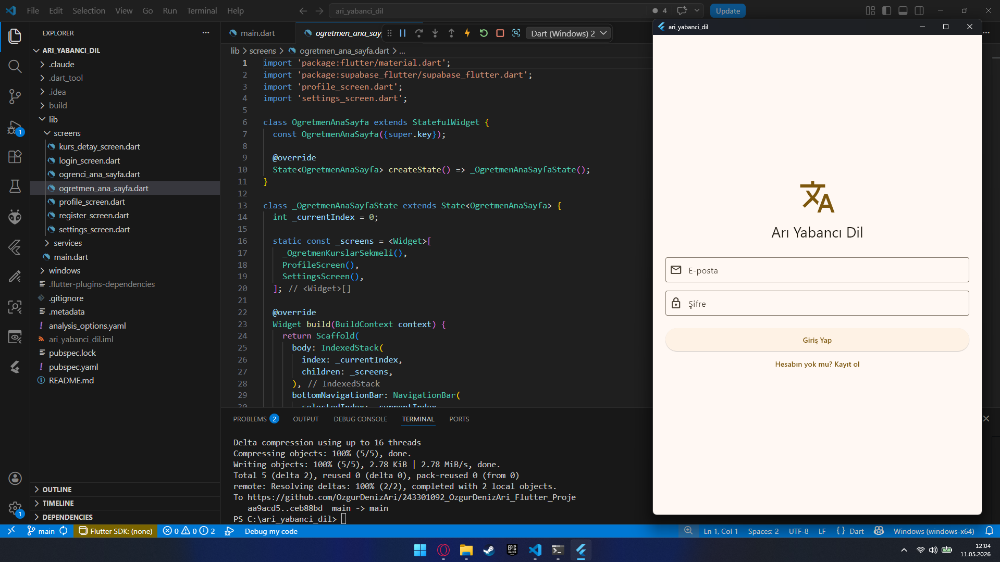
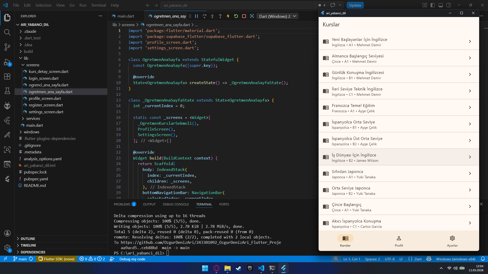
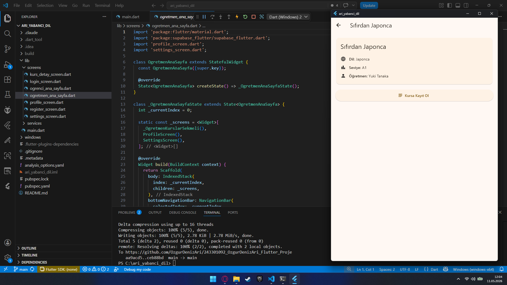

# Arı Yabancı Dil Uygulaması

**Öğrenci:** Özgür Deniz ARI  
**Öğrenci No:** 243301092  
**Ders:** Mobil Programlama
**Konu:** Dil Kursu Yönetim Sistemi  

## Uygulama Hakkında
Flutter ile geliştirilmiş, Supabase altyapılı bir dil okulu yönetim uygulamasıdır. Öğrenci ve öğretmen olmak üzere iki farklı kullanıcı rolü bulunmaktadır.

## Kullanılan Paketler
- supabase_flutter
- flutter (sdk)

## Test Hesapları

**Öğrenci:**  
E-posta: ilbeycavga@gmail.com  
Şifre: 123456

**Öğretmen:**  
E-posta: oktay@mail.com  
Şifre: 123456

## Ekran Görüntüleri

